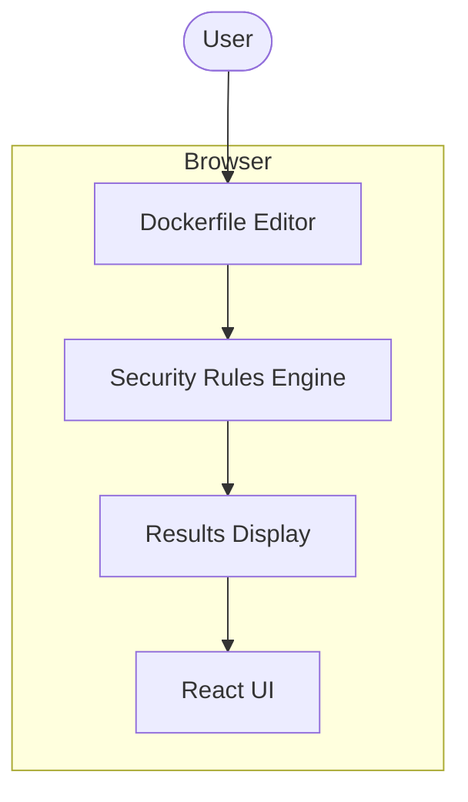

# Container Image Analyzer

A client-side Dockerfile security scanner that provides instant feedback on vulnerabilities, best practice violations, and actionable recommendations.

[](https://vercel.com/new/clone?repository-url=https://github.com/ryanwelchtech/container-image-analyzer)

## Features

- **17 Security Rules** - Comprehensive checks for common Dockerfile security issues
- **Real-time Analysis** - Instant feedback as you type
- **Privacy-First** - All analysis happens in your browser, no data sent to servers
- **Actionable Recommendations** - Clear guidance on how to fix each issue
- **Security Scoring** - Grade-based scoring system (A-F) with severity breakdown

## Security Checks

| Severity | Checks |
|----------|--------|
| Critical | Running as root, hardcoded secrets, using :latest tag |
| High | Missing HEALTHCHECK, ADD instead of COPY, no package cleanup, sudo usage |
| Medium | Missing WORKDIR, wildcard COPY, no multi-stage build, unverified downloads |
| Low | Missing maintainer label, deprecated MAINTAINER, multiple RUN layers |
| Info | Non-Alpine base images, missing EXPOSE documentation |

## Architecture



## Tech Stack

- **Framework**: Next.js 14+ (App Router)
- **Language**: TypeScript
- **Styling**: Tailwind CSS
- **Deployment**: Vercel

## Getting Started

### Prerequisites

- Node.js 18+
- npm or yarn

### Installation

```bash
# Clone the repository
git clone https://github.com/ryanwelchtech/container-image-analyzer.git
cd container-image-analyzer

# Install dependencies
npm install

# Run development server
npm run dev
```

Open [http://localhost:3000](http://localhost:3000) to view the application.

### Build for Production

```bash
npm run build
npm start
```

## Deployment

### Deploy to Vercel

1. Push your code to GitHub
2. Import the repository in [Vercel](https://vercel.com/new)
3. Deploy with default settings

Or use the one-click deploy button above.

## Sample Dockerfiles

The application includes three sample Dockerfiles to demonstrate the analyzer:

- **Insecure Example** - Multiple critical and high severity issues
- **Basic Example** - Some medium and low severity issues
- **Secure Example** - Follows best practices with minimal issues

## Security Rules Reference

### Critical (25 points each)
- **DL001**: Running as root user
- **DL002**: Secrets or credentials in Dockerfile
- **DL003**: Using :latest tag

### High (15 points each)
- **DL004**: No HEALTHCHECK defined
- **DL005**: Using ADD instead of COPY
- **DL006**: apt-get/apk without cleanup
- **DL007**: Using sudo in container

### Medium (8 points each)
- **DL008**: Missing WORKDIR instruction
- **DL009**: COPY with wildcard
- **DL010**: Not using multi-stage build
- **DL011**: Using curl/wget without verification

### Low (3 points each)
- **DL012**: Missing LABEL maintainer
- **DL013**: Using deprecated MAINTAINER
- **DL014**: Multiple RUN instructions
- **DL015**: apt-get without -y flag

### Info (1 point each)
- **DL016**: Consider using Alpine base image
- **DL017**: No EXPOSE instruction

## Contributing

1. Fork the repository
2. Create a feature branch (`git checkout -b feature/new-rule`)
3. Commit your changes (`git commit -m 'Add new security rule'`)
4. Push to the branch (`git push origin feature/new-rule`)
5. Open a Pull Request

## License

MIT License - see [LICENSE](LICENSE) for details.

## Author

**Ryan Welch** - Cloud & Systems Security Engineer

- Website: [ryanwelchtech.com](https://ryanwelchtech.com)
- GitHub: [@ryanwelchtech](https://github.com/ryanwelchtech)
- LinkedIn: [Ryan Welch](https://linkedin.com/in/ryanwelchtech)
